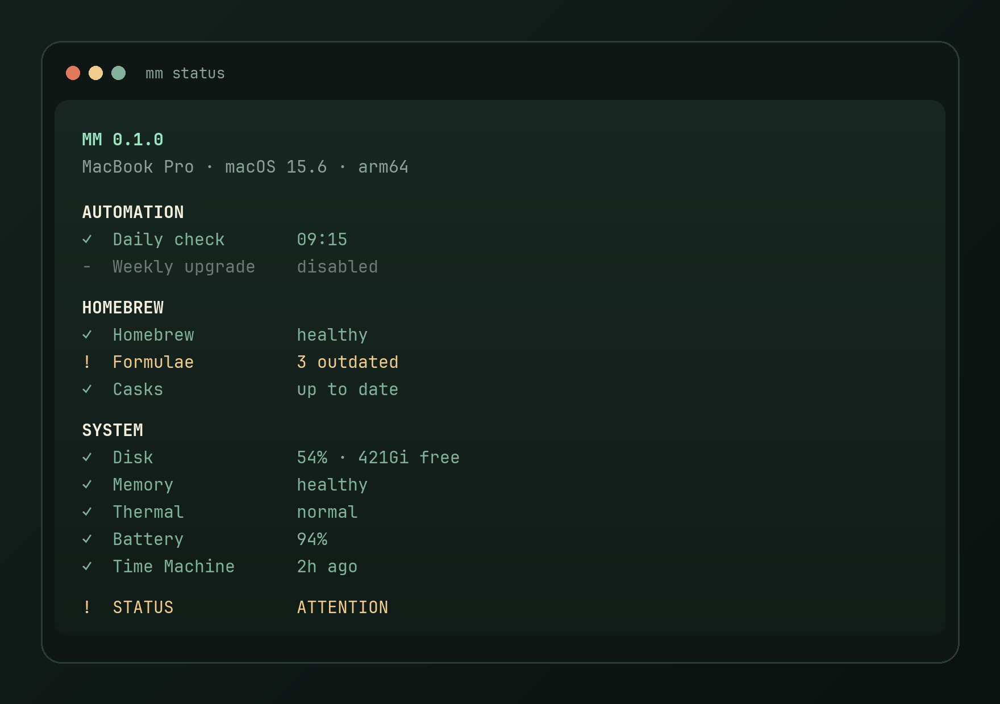

# mm

**A tiny, reliable health and maintenance CLI for macOS.**

`mm` is the command you run when you want a honest snapshot of a Mac — Homebrew drift, disk pressure, FileVault, Time Machine — without surprise upgrades, `sudo`, or a cleaner that deletes your files.

<p align="center">
  
</p>

<p align="center">
  
  
  
  
</p>

```bash
mm              # same as mm status — read-only dashboard
mm update       # refresh Homebrew metadata, never upgrade
mm upgrade      # explicit formula upgrades (casks opt-in)
```

---

## Why it exists

Most “Mac maintenance” tools either do too much, or they hide mutations behind a green button.

`mm` does the opposite:

| Promise | What that means |
| --- | --- |
| **Safe by default** | `mm` never upgrades packages, never calls `sudo`, never deletes user files. |
| **Explicit upgrades** | `mm update` reports. `mm upgrade` mutates. Weekly upgrades are **off** until you opt in. |
| **macOS-native** | `launchd`, `pmset`, `tmutil`, `fdesetup`, `csrutil`, `spctl` — not cron, not a daemon you cannot inspect. |
| **Predictable exits** | `0` healthy · `1` attention · `2` action required · `64` usage error |

---

## Install

### From a checkout

```bash
git clone https://github.com/R0PR1/a-little-Mac-Maintenance-Tool.git
cd a-little-Mac-Maintenance-Tool
make install
```

That copies the payload to `~/.local/share/mm` and writes a small launcher at `~/.local/bin/mm` (not a symlink to `bin/mm`, which would look for libraries in `~/.local/lib/mm`). Put `~/.local/bin` on your `PATH`.

```bash
make install PREFIX=$HOME/.local   # default
make reinstall                       # uninstall then install
make link                           # launcher pointing at this git checkout
make uninstall
```

Zsh completion lives in [`completions/_mm`](completions/_mm). With Homebrew or a fpath that includes the repo:

```zsh
fpath+=("$(pwd)/completions")
autoload -U compinit && compinit
```

### Homebrew formula template

A formula stub is in [`packaging/homebrew/mm.rb`](packaging/homebrew/mm.rb). Point `url` / `sha256` at a tagged release, then:

```bash
brew install --build-from-source packaging/homebrew/mm.rb
```

Uninstall a source install with `make uninstall`. Configuration (`~/.config/mm/`) and logs (`~/Library/Logs/mm/`) are preserved.

---

## The dashboard

```text
MM 0.1.0
MacBook Pro · macOS 15.6 · arm64

AUTOMATION
✓ Daily check       09:15
− Weekly upgrade    disabled

HOMEBREW
✓ Homebrew          healthy
! Formulae          3 outdated
✓ Casks             up to date

SYSTEM
✓ Disk              54% · 421Gi free
✓ Memory            healthy
✓ Thermal           normal
✓ Battery           94%
✓ Time Machine      2h ago

SECURITY
✓ FileVault
✓ SIP
✓ Gatekeeper

! STATUS            ATTENTION
  → mm upgrade
```

Colors appear only when stdout is a TTY. Missing tools degrade to `unavailable` instead of crashing.

---

## Commands

| Command | Mutates? | Purpose |
| --- | :---: | --- |
| `mm` / `mm status` | no | Concise health dashboard |
| `mm update` | metadata only | `brew update` + list outdated formulae and casks |
| `mm upgrade` | yes | Upgrade formulae. Casks only with `--casks` or `upgrade_casks=true` |
| `mm doctor` | no* | Verbose diagnostics (`brew doctor` is the only Homebrew diagnostic) |
| `mm security` | no | FileVault, SIP, Gatekeeper, firewall, automatic update policy |
| `mm logs` `[daily\|weekly\|--follow]` | no | Read `~/Library/Logs/mm/` |
| `mm config` | config file | Show / get / set / reset keys |
| `mm schedule` | launchd | Enable, disable, reload LaunchAgents |
| `mm menubar` | launchd | macOS menu extra next to the clock |
| `mm self-update` | install tree | Homebrew **or** git fast-forward, never both |
| `mm version` | no | Local version, plus a cached remote hint if one exists |

\* `mm doctor` does not change security settings, schedules, or packages.

Internal jobs used by launchd (not part of the public UX):

```bash
mm internal daily     # brew update + outdated report
mm internal weekly    # same, or mm upgrade if weekly_upgrade=true
```

Full reference: [docs/commands.md](docs/commands.md).

---

## Configuration

File: `~/.config/mm/config` (mode `600`). **Never sourced.** Only allow-listed keys are parsed.

```ini
daily_enabled=true
daily_hour=09
daily_minute=15
weekly_enabled=false
weekly_day=0
weekly_hour=10
weekly_minute=00
weekly_upgrade=false
upgrade_casks=false
cleanup=true
check_macos=true
check_battery=true
check_time_machine=true
check_thermal=true
disk_warning=80
disk_critical=90
```

```bash
mm config
mm config get weekly_upgrade
mm config set weekly_upgrade true
mm config reset weekly_upgrade
```

`weekly_day` is launchd’s weekday: `0` = Sunday.

---

## Scheduling

`mm` uses **launchd**, not cron. Agents are generated from templates in [`launchd/`](launchd/) and installed to `~/Library/LaunchAgents/`.

```bash
mm schedule enable daily
mm schedule enable weekly
mm schedule disable daily
mm schedule reload
mm schedule status
```

Daily checks refresh Homebrew metadata. Weekly **upgrades** stay off until:

```bash
mm config set weekly_upgrade true
mm schedule enable weekly
```

---

## Menu extra (macOS)

A tiny `mm ●` item in the menu bar (next to the clock). Sage = healthy, amber = attention, pulsing sage = a job is running.

```bash
mm menubar enable
mm menubar status
mm menubar disable
```

Requires **Xcode Command Line Tools** (`swiftc`). Click the extra for disk, battery, Time Machine, Homebrew, then Open Dashboard / Run check now / Upgrade formulae (only when outdated).

---

## Self-update

| Install | What `mm self-update` does |
| --- | --- |
| Homebrew | `brew update` + `brew upgrade mm` — never overwrites Cellar files itself |
| Git checkout | `git fetch` then `git pull --ff-only` if the tree is clean |
| Standalone copy | Refuses; from a clone run `make install` |

`mm version` does **not** hit the network. If a previous self-update wrote `~/Library/Caches/mm/remote-version`, it will mention that a newer version was seen.

---

## Development

```bash
make syntax
make lint    # ShellCheck
make test    # Bats, fully mocked — does not touch real Homebrew or LaunchAgents
```

Read [CURSOR.md](CURSOR.md) before changing behavior. Architecture notes live in [docs/architecture.md](docs/architecture.md).

---

## Safety

- No implicit `sudo`
- No deleting `~/Documents`, caches, or Trash
- No cask upgrades unless you ask
- No weekly upgrades unless you opt in
- Tests inject `brew`, `launchctl`, `tmutil`, `fdesetup`, … via `PATH`

If you find a way `mm` can destroy data or escalate privileges, see [SECURITY.md](SECURITY.md).

---

## License

[MIT](LICENSE) © 2026 Romain Perrin
